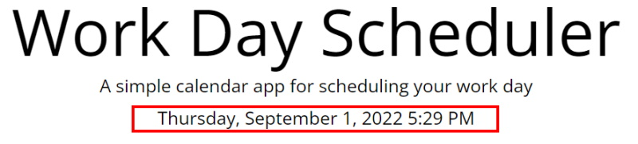
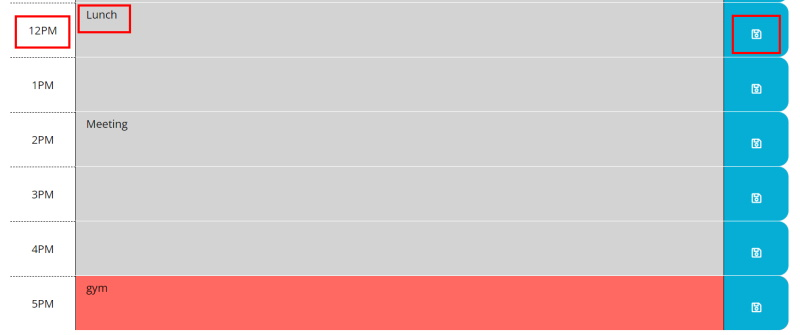

# work-day-scheduler

# Work Day Scheduler

## Description

I developed a work day schedular so that a user could easily track their daily plans as it progressed. I wanted it clearly to highlight for the user what day and time it was, and that then to be reflected in the planner back at them with changing colours to represent the past, present and future. 

Doing this allowed me to practise bootstrap, moment.js, adding and removing elements via juqery and appending data to local storage which would persist upon page refresh.

---

## Table of Contents

- [Installation](#installation)
- [Usage](#usage)
- [Resources](#resources)
- [License](#license)
- [Features](#features)
- [Resources](#credits)

---

## Installation

You are required to have a code editor such as VS Code if you want to clone/pull the repo. 

Aside from this the application should work on most browsers.

---

## Usage

To use the daily planner open the application. Note that the jumbotron will display the current day, date and time. 

The first column depicts the different time blocks. Front end uses 24hr time while the code will communicate in 24hr for necessary functionality. The last column depicts the save button for each row, with small save icon in white to display this.

Where needed click into the timeblock text area to enter your planner entries, click save, refresh and the data will persist. You can even close the page and it should persist if you reopen it. 

Note that past time blocks are grey, current time blocks are red, and green time blocks are the future.

You can view the deployed application through the link below!

https://rosemaryjf.github.io/work-day-scheduler/

---

## Resources

Below I have listed the resources I used to help me acquire the knowledge for how best to implement the scheduler functionality. I really tried to stick to JQuery this challenge and found that deciding this and using the documentation as much as possible was a great help.

* https://api.jquery.com/removeclass/
* https://api.jquery.com/addclass/
* https://api.jquery.com/each/
* https://api.jquery.com/click/
* https://api.jquery.com/category/traversing/
* https://api.jquery.com/siblings/
* https://api.jquery.com/parent/
* https://api.jquery.com/jquery.trim/
* https://api.jquery.com/data/
* https://developer.mozilla.org/en-US/docs/Web/API/Window/localStorage
* https://api.jquery.com/show/
* https://stackoverflow.com/questions/10507294/how-to-get-the-value-of-a-textarea-in-jquery

---

